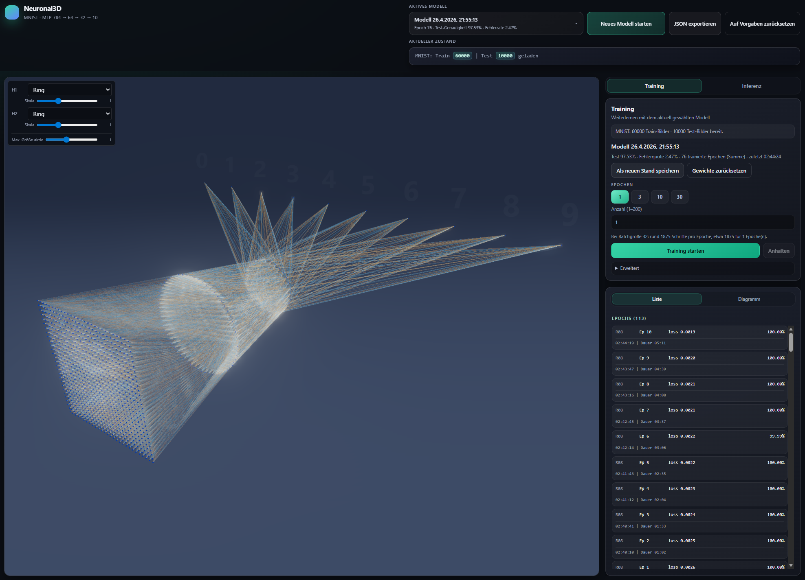
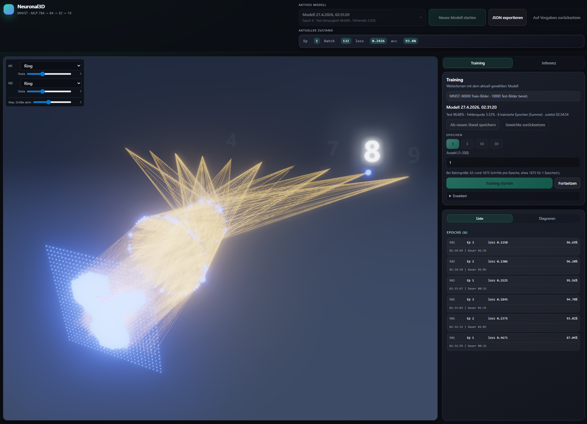
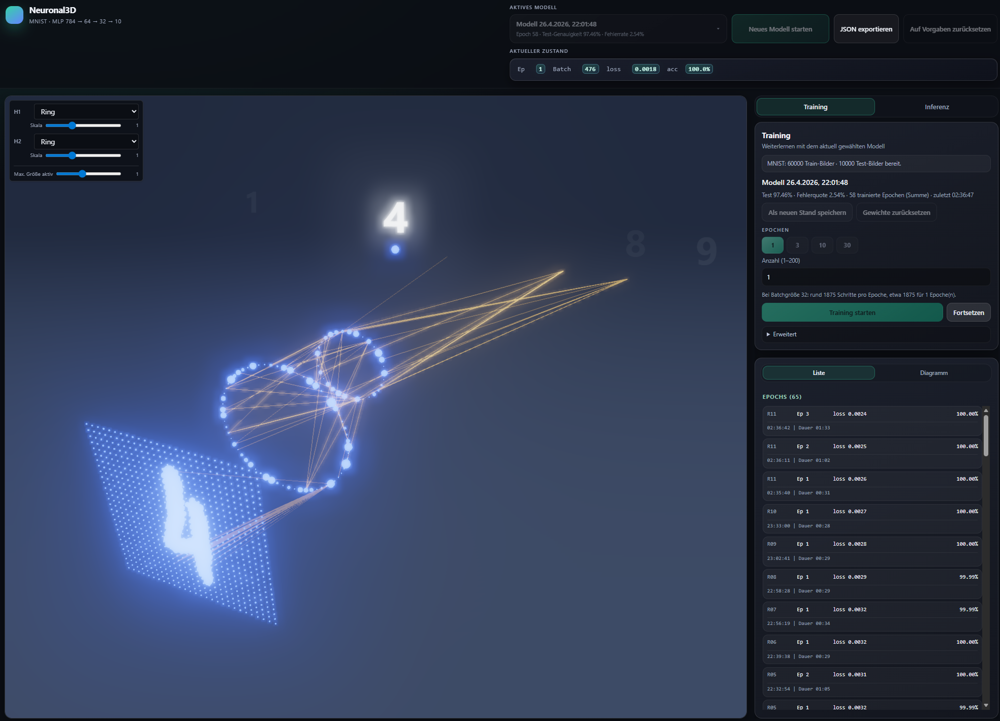
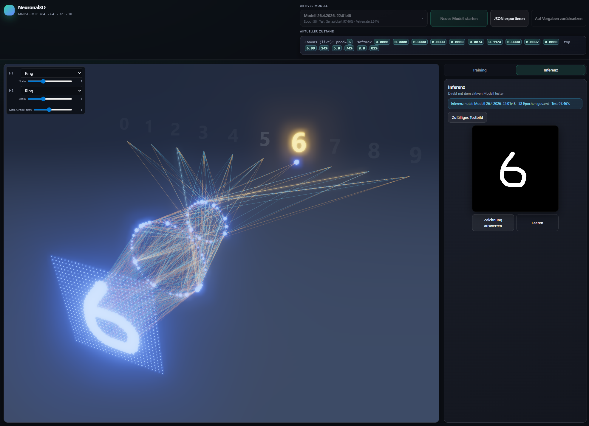

<div align="center">

# 🧠 Neuronal3D

> **MNIST im Browser trainieren** — MLP in reinem TypeScript, CSV-Import und **3D-Visualisierung** der Aktivierungen mit Three.js.

[](https://angular.dev/)
[](https://www.typescriptlang.org/)
[](https://threejs.org/)
[](https://pnpm.io/)
[](LICENSE)

[MIT-Lizenz](LICENSE)

<p align="center">
  
</p>

<p align="center"><em>Hauptansicht: das Netz als räumliches Modell — nicht nur Kurven, sondern Schichten, Verbindungen und Klassen im Raum.</em></p>

</div>

---

## ✨ Was ist Neuronal3D?

Neuronal3D ist eine **Single-Page-Anwendung** auf Basis von **Angular**, **NgRx** und **Tailwind CSS**. Das neuronale Netz ist bewusst **ohne Framework wie TensorFlow.js** implementiert: Forward- und Backpropagation laufen als verständlicher TypeScript-Code im Browser.

**Ursprüngliche Motivation:** Das Projekt ist in erster Linie dafür gedacht, **ein neuronales Netz wirklich in 3D zu sehen** — Schichten als Geometrie, Datenfluss als sichtbare Struktur, Vorhersagen als räumlich angeordnete Ausgaben. MNIST, CSV-Training und die komplette Trainings-UI sind das **Fahrzeug**, um ein laufendes MLP zu haben, dessen Aktivierungen und Topologie du in einer **Three.js**-Szene drehen, skalieren und mit verschiedenen Layer-Layouts (z. B. Ringe) erkunden kannst. Tabellen mit Gewichten oder flache Layer-Diagramme ersetzen das nicht: Hier geht es um **räumliches Verständnis** und **Live-Feedback**, während das Netz lernt oder inferiert.

Die Oberfläche verbindet deshalb eine große **3D-Bühne** mit **Training**, **Epochen-Historie** und **Inferenz** — ideal zum Experimentieren mit Hyperparametern und zum „Hinsehen“, was das Netz bei einer Ziffer gerade macht.

### Fokus: die 3D-Bühne

- **Eingang:** MNIST-Grid (28×28 → 784 Knoten) als flächiges Gitter im Raum
- **Hidden Layers:** konfigurierbare Anordnung (z. B. **Ring**-Layouts), skalierbar, mit sichtbaren Verbindungen
- **Ausgang:** die Klassen **0–9** im 3D-Raum; während Training und Inferenz siehst du, welche Ausgabe stärker „leuchtet“
- **Interaktion:** Kamera und Darstellungsoptionen, damit du das MLP wie ein räumliches Objekt untersuchen kannst

### Wofür es gedacht ist

- **3D-Verständnis:** Architektur und Datenfluss nicht nur als Formel, sondern als Szene
- **Lernen & Demos:** nachvollziehbares MLP statt Blackbox-Bibliothek
- **Schnelle Iteration:** CSV rein, Loss und Genauigkeit in der UI — die 3D-Ansicht reagiert auf denselben Lauf
- **Offline-freundlich:** lokal nutzbar; vortrainierte Artefakte aus `public/pretrained` optional per Bootstrap

---

## 🚀 Features

| Bereich                      | Beschreibung                                                                       |
| ---------------------------- | ---------------------------------------------------------------------------------- |
| 🏋️ **Training**              | Train- und Test-CSV wählen, Training starten, Epochen- und Modellzustand in der UI |
| 🎲 **3D-Ansicht**            | Aktivierungen und Netzstruktur räumlich dargestellt                                |
| 🔮 **Inferenz**              | Zufälliges Testbild oder Canvas-Eingabe, Vorhersage anzeigen                       |
| 📦 **Vortrainierte Modelle** | Bootstrap aus `public/pretrained` in den lokalen Speicher                          |

---

## 📸 Screenshots

Die folgenden Ausschnitte **2** und **3** zeigen beides **während des Trainings** — einmal **kurz nach Start** (wenige Epochen) und einmal **nach längerem Laufen** (viele Epochen). **4** ist der **Inferenz**-Tab.

### Gesamtansicht mit Training

Die **Abbildung ganz oben** zeigt diese Szene im Überblick: zentrale **3D-Ansicht** mit MLP (z. B. **784 → 64 → 32 → 10**), Eingangsgrid, Ring-Schichten, Verbindungen und Ausgabe-Klassen — daneben Training, Epochen und Status in einer Oberfläche.

### Training mit wenigen Epochen

Noch **früh im Trainingslauf**: höhere Loss-Werte, wechselnde Batch-Metriken in der Statuszeile — die **3D-Ansicht** zeigt denselben Lauf mit Eingangsbeispiel, Schichten und hervorgehobener Ausgabe-Klasse, während das Netz gerade erst lernt.

<p align="center"></p>

### Training mit vielen Epochen

**Später im Training** (viele Epochen, Modell bereits stark): Loss und Accuracy in der UI spiegeln den fortgeschrittenen Stand wider; im 3D-Raum siehst du weiterhin Eingabe und Ausgabe im Kontext — jetzt typischerweise mit **stabilerer**, klarerer Vorhersage auf dem aktuellen Batch-Beispiel.

<p align="center"></p>

### Inferenz-Tab mit Zeichenfläche

Unter **Inferenz** zeichnest du Ziffern auf dem Canvas oder lädst ein zufälliges Testbild; die **Softmax-Leiste** und die **3D-Szene** zeigen parallel die Vorhersage — vom Strich auf dem Canvas bis zur leuchtenden Klasse im Netz.

<p align="center"></p>

---

## ⚡ Erste Schritte

### Voraussetzungen

- **Node.js** `^18.19.1`, `^20.11.1` oder `>=22.0.0` (siehe `package.json` → `engines`)
- **pnpm** — die im Repo festgelegte Version wird über `packageManager` genutzt; `preinstall` erlaubt nur pnpm

### Installation & Dev-Server

[Corepack](https://nodejs.org/api/corepack.html) aktivieren, damit pnpm in der erwarteten Version verfügbar ist:

```bash
corepack enable
```

Abhängigkeiten installieren und Anwendung starten:

```bash
pnpm install
pnpm start
```

### Weitere Befehle

| Befehl        | Zweck                |
| ------------- | -------------------- |
| `pnpm build`  | Produktions-Build    |
| `pnpm test`   | Unit-Tests (Karma)   |
| `pnpm watch`  | Build im Watch-Modus |

---

## 📊 Datenformat & Bedienung

### MNIST als CSV

Eine Zeile pro Bild, **785 Spalten**:

- Spalte 1: Label `0`–`9`
- Spalten 2–785: Pixel `0`–`255`, zeilenweise für `28×28`

Kompatibel z. B. mit den Kaggle-Datensätzen „mnist-as-csv“ (`mnist_train.csv`, `mnist_test.csv`).

### Workflow in der App

Train- und Test-CSV auswählen → **Training starten**. Nach dem Training: **Zufälliges Testbild** oder auf dem Canvas zeichnen und **Canvas inferieren** — und dabei die **3D-Ansicht** nutzen, um zu sehen, wie sich Aktivität und Vorhersage über die Schichten bewegen.

---

## 🎛️ Konfiguration

Hyperparameter (**Lernrate**, `batchSize`, `epochs`, `vizEveryNBatches`) stellst du im `trainLoop`-Aufruf in **`src/main.ts`** ein.

---

## 🗂️ Projektstruktur

| Pfad                          | Inhalt                                       |
| ----------------------------- | -------------------------------------------- |
| `src/app/neuronal-workspace/` | Haupt-Workspace-Layout                       |
| `src/app/workspace-ui/`       | Training, Inferenz, Epochenliste, 3D-Shell   |
| `src/neuronal-app.ts`         | Laufzeit / Orchestrierung der neuronalen App |
| `public/pretrained/`          | Vorlagen für Modelle / Epochen (Bootstrap)   |

---

## 📄 Lizenz

Veröffentlicht unter der [MIT License](LICENSE).
